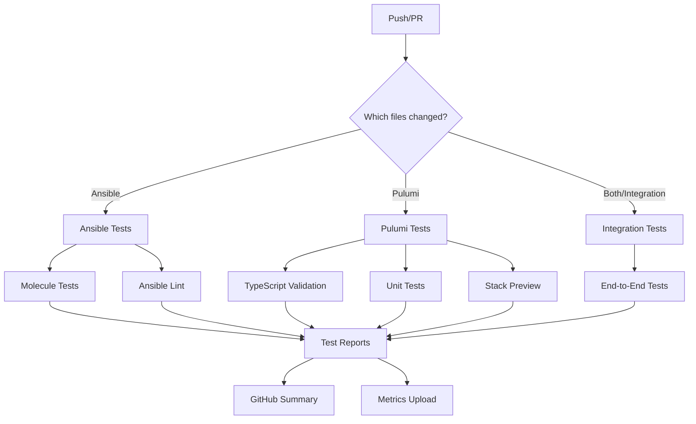

# 🏠 Homelab Infrastructure Repository

This repository contains Infrastructure as Code (IaC) for managing a personal homelab environment using Kubernetes (K3s), Ansible, and Pulumi.

## 🎯 Overview

Managing infrastructure for:
- 🖥️ Control Node: Beelink SEi8 (WSL2 + K3s)
- 🤖 AI Node: NVIDIA Jetson AGX Orin
- 🏡 Home Automation: Home Assistant Yellow

For a comprehensive To-Do List based on the analysis of code refactoring opportunities, missing or incomplete code, import and dependency management, information flow and integrity, code correctness, and documentation accuracy and completeness, please refer to the [Implementation Roadmap](docs-site/docs/implementation-roadmap.md).

## 📋 Prerequisites

- WSL2 on Windows 10/11
- Docker Desktop
- Kubernetes CLI (kubectl)
- Ansible 9+
- Pulumi CLI
- Python 3.10+
- Git

## 🚀 Getting Started

1. Clone the repository:
```bash
git clone https://github.com/SPRIME01/homelab-infra.git
cd homelab-infra
```

2. Install dependencies:
```bash
pip install -r requirements.txt
```

3. Configure environment:
```bash
cp .env.example .env
# Edit .env with your settings
```

## 📁 Repository Structure

```
homelab-infra/
├── ansible/         # 🔧 Ansible playbooks and roles for node configuration
├── kubernetes/      # ⚙️ K3s manifests and configurations
├── pulumi/          # 🌐 Pulumi IaC code for infrastructure provisioning
├── scripts/         # 📜 Utility scripts for testing, deployment, etc.
├── monitoring/      # 📊 Prometheus, Grafana, and Loki configurations
├── tests/           # ✅ Test suites (Molecule, Testinfra, Pytest)
└── docs/            # 📚 Documentation
```

## 🔄 Workflow

1. **Infrastructure Provisioning**: Use Pulumi to provision base infrastructure (K3s cluster, storage, core services).
2. **Node Configuration**: Configure nodes using Ansible playbooks for system-level settings and application deployment.
3. **Application Deployment**: Deploy applications and services using K3s manifests.
4. **Automated Testing**: Run Molecule, Testinfra, and Pytest suites to validate infrastructure and application state.
5. **Continuous Monitoring**: Monitor system performance, application health, and test results using Prometheus, Grafana, and Loki.

---

## 🧪 Testing Strategy

The project employs a comprehensive testing strategy using Molecule, Testinfra, and Pytest. Key aspects include:

* **Molecule**: Role-based testing with Docker driver, ensuring idempotency and proper configuration.
* **Testinfra**: Verification of infrastructure state, Kubernetes resources, and service configurations.
* **Pytest**: Unit and integration tests for Pulumi deployments, logging, and metrics.
* **Pre-commit Hooks**: Automated code quality checks and quick validation tests.
* **CI/CD Pipeline**: GitHub Actions workflow for continuous integration and automated testing.
* **Logging & Monitoring**: Loki for log aggregation, Prometheus for metrics, and Grafana for visualization.

## 📊 Monitoring and Observability Stack

The monitoring and observability stack includes:

* **Prometheus**: Metrics monitoring and alerting.
* **Grafana**: Data visualization and dashboarding.
* **Loki**: Log storage and aggregation.
* **Tempo**: Distributed tracing.
* **OpenTelemetry**: Unified collection of metrics, logs, and traces.

## ⚙️ Key Scripts

* `deploy-ansible.sh`: Deploys Ansible playbook configurations.
* `test-ansible.sh`: Tests Ansible playbooks and roles (linting, syntax, dry-run).
* `deploy-pulumi.sh`: Deploys infrastructure using Pulumi stacks.
* `test-pulumi.sh`: Tests Pulumi configurations.
* `deploy-dashboards.sh`: Deploys Grafana dashboards to Kubernetes.
* `deploy-correlator.sh`: Deploys the log-metric correlator service.
* `run-molecule-tests.sh`: Runs Molecule tests for Ansible roles.
* `setup-test-environment.sh`: Sets up the test environment.

## 📝 Setting Up the Environment

1. Clone the repository:
```bash
git clone https://github.com/SPRIME01/homelab-infra.git
cd homelab-infra
```

2. Set up a Python virtual environment:
```bash
uv venv .venv
source .venv/bin/activate  # On Windows: .venv\Scripts\activate
```

3. Install dependencies:
```bash
uv pip install -e ".[dev]"
```

4. Install pre-commit hooks:
```bash
pre-commit install
pre-commit install --hook-type commit-msg
```

5. Configure environment variables:
```bash
cp .env.example .env
# Edit .env with your configuration
```

## 🧪 Running Tests

### Running Ansible Role Tests
To test individual Ansible roles:
```bash
# Test a specific role with all test stages
./scripts/test-ansible.sh -r <role_name>

# Test with specific stages
./scripts/test-ansible.sh -r <role_name> -s lint -s syntax -s dry-run
```
Available stages:

- lint: Check style and best practices
- syntax: Verify syntax without execution
- dry-run: Execute in check mode
- check: Full test with idempotence check
- apply: Apply changes (use cautiously)

Example:
```bash
./scripts/test-ansible.sh -r k3s_server -s lint -s dry-run
```

### Running Pulumi Tests
Test Pulumi infrastructure code:
```bash
# Test all Pulumi stacks
./scripts/test-pulumi.sh

# Test specific stack
./scripts/test-pulumi.sh -s cluster-setup

# Only run validation (TypeScript check)
./scripts/test-pulumi.sh --validate-only

# Only run unit tests
./scripts/test-pulumi.sh --test-only

# Only run preview
./scripts/test-pulumi.sh --preview-only
```

Example testing the storage stack with increased verbosity:

```bash
./scripts/test-pulumi.sh -s storage --verbose
```

### Running Molecule Tests
Execute Molecule tests for Ansible roles:
```bash
# Run all Molecule stages for a role
./scripts/run-molecule-tests.sh <role_name>

# Run specific commands
./scripts/run-molecule-tests.sh -c lint <role_name>
./scripts/run-molecule-tests.sh -c converge <role_name>
./scripts/run-molecule-tests.sh -c verify <role_name>

# Run with a specific scenario
./scripts/run-molecule-tests.sh -s ha-cluster <role_name>

# Enable verbose output
./scripts/run-molecule-tests.sh -v <role_name>
```

Example:
```bash
./scripts/run-molecule-tests.sh k3s_server
./scripts/run-molecule-tests.sh -c converge k3s_server
```

### Running End-to-End Tests
Execute end-to-end tests that verify the entire infrastructure:
```bash
# Run all tests
uv run pytest tests/

# Run specific test categories
uv run pytest tests/ -m prometheus
uv run pytest tests/ -m loki
uv run pytest tests/ -m k8s

# Run with output to Prometheus metrics
PUSHGATEWAY_URL=http://localhost:9091 TEST_RUN_ID=manual-$(date +%s) pytest tests/
```

## 📈 CI/CD Pipeline

Our CI/CD pipeline uses GitHub Actions for automated testing and deployment.

### GitHub Actions Workflows
The pipelines are defined in the .github/workflows/ directory:

- ansible-tests.yml: Tests Ansible roles and playbooks
- pulumi-tests.yml: Tests Pulumi infrastructure code
- molecule-tests.yml: Runs Molecule tests for all roles
- integration-tests.yml: Runs end-to-end integration tests

### Pipeline Structure



## 🤝 Contributing

1. Fork the repository
2. Create a feature branch
3. Commit changes
4. Submit Pull Request

## 📝 License

MIT License - See [LICENSE](LICENSE) for details

## ⚠️ Disclaimer

This is a personal homelab setup. Use at your own risk.

## 📫 Contact

Create an issue for questions or problems.
