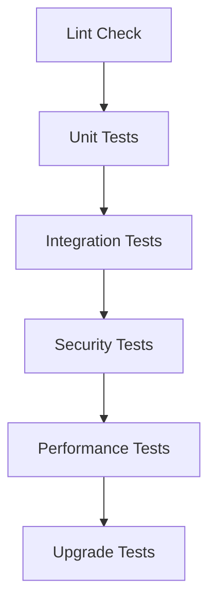

# CI/CD and Advanced Testing Guide

This document covers continuous integration setup and advanced testing scenarios for the K3s server role.

## Continuous Integration

### GitHub Actions Setup

```yaml
name: Role Testing

on:
  push:
    paths:
      - 'ansible/roles/k3s_server/**'
  pull_request:
    paths:
      - 'ansible/roles/k3s_server/**'

jobs:
  molecule:
    runs-on: ubuntu-latest
    steps:
      - name: Checkout code
        uses: actions/checkout@v3

      - name: Set up Python
        uses: actions/setup-python@v4
        with:
          python-version: '3.10'

      - name: Install dependencies
        run: |
          python -m pip install --upgrade pip
          pip install -r requirements.txt

      - name: Run Molecule tests
        run: |
          ./scripts/run-molecule-tests.sh k3s_server
        env:
          MOLECULE_DOCKER_IMAGE: geerlingguy/docker-ubuntu2204-ansible:latest
          ANSIBLE_FORCE_COLOR: "1"
```

### Pre-commit Hooks

```yaml
# .pre-commit-config.yaml
repos:
  - repo: local
    hooks:
      - id: ansible-lint
        name: Ansible Lint
        entry: ansible-lint
        language: system
        files: ^ansible/roles/k3s_server/
        pass_filenames: false

      - id: molecule-test
        name: Molecule Test
        entry: ./scripts/run-molecule-tests.sh k3s_server
        language: system
        pass_filenames: false
```

## Advanced Testing Scenarios

### 1. Multi-Node Testing

Testing K3s cluster formation with multiple nodes:

```yaml
# molecule/multi-node/molecule.yml
platforms:
  - name: k3s-server-1
    groups:
      - k3s_server
  - name: k3s-server-2
    groups:
      - k3s_server
  - name: k3s-agent-1
    groups:
      - k3s_agent
```

### 2. Network Failure Testing

Testing behavior under network conditions:

```yaml
# molecule/network-failure/prepare.yml
- name: Simulate network issues
  hosts: all
  tasks:
    - name: Install traffic control
      package:
        name: iproute2
        state: present

    - name: Add network latency
      command: tc qdisc add dev eth0 root netem delay 100ms
```

### 3. Upgrade Testing

Testing K3s version upgrades:

```yaml
# molecule/upgrade/converge.yml
- name: Test K3s upgrade
  hosts: all
  tasks:
    - name: Install initial K3s version
      include_role:
        name: k3s_server
      vars:
        k3s_server_version: "v1.25.0+k3s1"

    - name: Upgrade K3s
      include_role:
        name: k3s_server
      vars:
        k3s_server_version: "v1.26.0+k3s1"
```

## Performance Testing

### 1. Resource Usage Monitoring

```yaml
# molecule/performance/verify.yml
- name: Verify resource usage
  hosts: all
  tasks:
    - name: Check CPU usage
      command: top -bn1
      register: cpu_usage

    - name: Check memory usage
      command: free -m
      register: memory_usage

    - name: Assert resource limits
      assert:
        that:
          - cpu_usage.stdout | regex_search('k3s.*') | float < 50
          - memory_usage.stdout | regex_search('Mem:.*') | float < 512
```

### 2. Load Testing

```yaml
# molecule/load-test/verify.yml
- name: Verify under load
  hosts: all
  tasks:
    - name: Deploy test workloads
      k8s:
        definition: "{{ lookup('template', 'test-deployment.yml') }}"
        wait: yes

    - name: Check cluster health
      command: kubectl get nodes
      register: node_status
      until: node_status.rc == 0
      retries: 6
      delay: 10
```

## Security Testing

### 1. Permission Validation

```yaml
# molecule/security/verify.yml
- name: Verify security settings
  hosts: all
  tasks:
    - name: Check file permissions
      stat:
        path: "{{ item }}"
      register: file_stats
      loop:
        - "{{ k3s_server_config_file }}"
        - "{{ k3s_server_token_file }}"

    - name: Validate permissions
      assert:
        that:
          - file_stats.stat.mode == '0600'
          - file_stats.stat.pw_name == 'root'
```

### 2. Network Security

```yaml
# molecule/security/verify.yml
- name: Verify network security
  hosts: all
  tasks:
    - name: Check open ports
      command: ss -tulpn
      register: open_ports

    - name: Validate port security
      assert:
        that:
          - open_ports.stdout is not search("6443")
          - open_ports.stdout is not search("10250")
```

## Integration Testing

### 1. External Service Integration

```yaml
# molecule/integration/verify.yml
- name: Verify external integrations
  hosts: all
  tasks:
    - name: Test metrics-server
      command: kubectl top nodes
      register: metrics_result
      until: metrics_result.rc == 0
      retries: 6
      delay: 10

    - name: Test service discovery
      command: kubectl get endpoints kubernetes
      register: endpoints
      failed_when: endpoints.rc != 0
```

### 2. Storage Integration

```yaml
# molecule/storage/verify.yml
- name: Verify storage functionality
  hosts: all
  tasks:
    - name: Create test PVC
      k8s:
        definition: "{{ lookup('template', 'test-pvc.yml') }}"
        wait: yes

    - name: Verify PVC binding
      command: kubectl get pvc
      register: pvc_status
      until: pvc_status.stdout is search("Bound")
      retries: 6
      delay: 10
```

## Automated Testing Pipeline

### 1. Test Sequence



### 2. Test Matrix

| Test Type | Frequency | Duration | Dependencies |
|-----------|-----------|----------|--------------|
| Lint | Every commit | < 1 min | None |
| Unit | Every commit | 2-3 min | Docker |
| Integration | Daily | 10-15 min | K8s tools |
| Security | Daily | 5-10 min | Security tools |
| Performance | Weekly | 30-45 min | Monitoring tools |
| Upgrade | Release | 45-60 min | Multiple K3s versions |

## Test Result Analysis

### 1. Performance Metrics

- CPU Usage < 50%
- Memory Usage < 512MB
- Startup Time < 30s
- API Response Time < 500ms

### 2. Success Criteria

- All linting passes
- Unit tests pass
- Integration tests pass
- No security vulnerabilities
- Performance within metrics
- Successful version upgrade