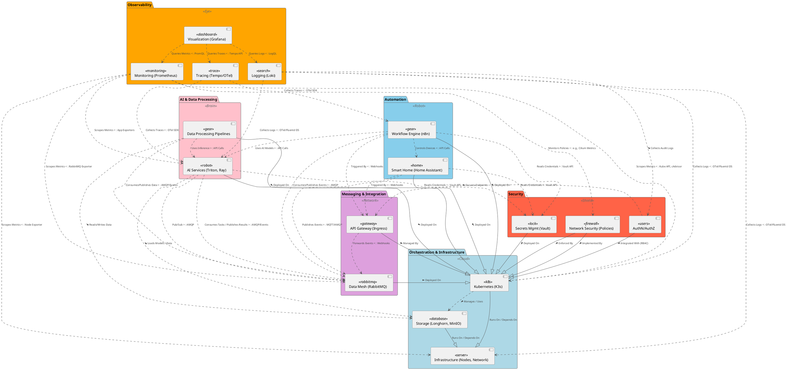

# Homelab Component Relationship Diagram 🧩

This diagram shows the high-level relationships and dependencies between the major subsystems in the homelab.

**Explanation of Notation:**

*   **Components:** Represented by rectangles grouped into packages (subsystems). Icons (`<<icon>>`) help identify component types.
*   **Packages:** Group related components (e.g., "Observability", "AI & Data Processing").
*   **Arrows:** Indicate relationships between components.
    *   `--|>` (Inheritance/Realization): Strong dependency, "Runs On" or "Implemented By". (e.g., K8s runs on Infra).
    *   `..>` (Dotted Dependency): Weaker dependency, "Uses", "Communicates With", "Manages", "Monitors", "Secures", "Reads/Writes", "Pub/Sub". Labels clarify the specific interaction.
*   **Labels:** Describe the nature of the relationship (e.g., `Loads Models / Data`, `Scrapes Metrics`, `Secures Endpoints`). Emojis add visual cues.
*   **Cardinality/Direction:** Arrows show the direction of dependency or primary data flow/initiation. `<` and `>` symbols near labels sometimes further clarify directionality (e.g., `Scrapes Metrics <`).

This diagram helps visualize the interconnectedness of the homelab subsystems and understand the key dependencies and communication paths.
