# Homelab Deployment Sequence Diagram 🚀

This diagram outlines the recommended order for deploying the homelab components, highlighting dependencies and validation checkpoints.

```mermaid
sequenceDiagram
    participant Admin as 🧑‍💻 Admin/CI/CD
    participant Nodes as 🖥️ Physical Nodes
    participant K3s as ☸️ K3s Cluster
    participant Storage as 💾 Storage (Longhorn/MinIO)
    participant DataMesh as 🐇 Data Mesh (RabbitMQ)
    participant AI as 🧠 AI Infra (Triton/Ray)
    participant Observability as 📊 Observability Stack
    participant Automation as 🤖 Automation (n8n/HA)
    participant Security as 🛡️ Security (Vault/NetPol)
    participant Networking as 🌐 Networking (Ingress/DNS)

    Admin->>Nodes: 1. Configure Base OS & Network (Ansible)
    activate Nodes
    Note over Nodes: Install prerequisites (containerd, etc.)
    Admin->>Nodes: Validate Node Configuration ✅
    deactivate Nodes

    Admin->>Nodes: 2. Deploy K3s Cluster (Server & Agents)
    activate K3s
    Nodes-->>K3s: Join Cluster
    Admin->>K3s: Validate Cluster Health (kubectl get nodes) ✅
    Note over K3s: CoreDNS running

    Admin->>K3s: 3. Deploy Storage (Longhorn CRDs/Manager, MinIO)
    activate Storage
    Note right of K3s: Depends on K3s API
    K3s-->>Storage: Provision Storage Classes
    Admin->>Storage: Validate Storage Provisioning (Test PVC) ✅
    deactivate Storage

    Admin->>K3s: 4. Deploy Data Mesh (RabbitMQ Operator/Cluster)
    activate DataMesh
    Note right of K3s: Depends on K3s, Storage (for PVs)
    K3s-->>DataMesh: Schedule Pods
    Admin->>DataMesh: Validate RabbitMQ UI/Connectivity ✅
    deactivate DataMesh

    Admin->>K3s: 5. Deploy AI Infra (Triton, Ray Operator/Cluster)
    activate AI
    Note right of K3s: Depends on K3s, Storage (Models/Data)
    K3s-->>AI: Schedule Pods, Allocate GPU
    Admin->>AI: Validate Triton/Ray Health, Test Inference ✅
    deactivate AI

    Admin->>K3s: 6. Deploy Observability Stack (Prometheus, Grafana, Loki, OTel)
    activate Observability
    Note right of K3s: Depends on K3s, Storage (Metrics/Logs)
    K3s-->>Observability: Schedule Pods
    Observability->>K3s: Scrape Metrics/Logs
    Observability->>AI: Scrape Metrics/Logs
    Observability->>DataMesh: Scrape Metrics/Logs
    Admin->>Observability: Validate Dashboards & Data Ingestion ✅
    deactivate Observability

    Admin->>K3s: 7. Deploy Automation (n8n, Home Assistant)
    activate Automation
    Note right of K3s: Depends on K3s, Storage, DataMesh
    K3s-->>Automation: Schedule Pods
    Automation->>DataMesh: Connect for Events
    Admin->>Automation: Validate n8n/HA UI & Basic Workflows ✅
    deactivate Automation

    Admin->>K3s: 8. Deploy Security Components (Vault, Network Policies)
    activate Security
    Note right of K3s: Depends on K3s, Storage
    K3s-->>Security: Schedule Pods, Apply Policies
    Security->>K3s: Integrate with RBAC
    Admin->>Security: Validate Vault Access & Network Policy Enforcement ✅
    deactivate Security

    Admin->>K3s: 9. Configure Networking (Ingress Controller, DNS Records)
    activate Networking
    Note right of K3s: Depends on K3s
    K3s-->>Networking: Schedule Ingress Controller
    Networking->>K3s: Manage Ingress Resources
    Admin->>Networking: Validate External Access & Service Discovery ✅
    deactivate Networking

    Admin->>K3s: Final System Validation & Testing ✅
    Note over Admin, Networking: End-to-end tests, Security Scans
```

**Key:**

*   **Arrows:** Show the flow of actions initiated by the Admin/CI/CD process or interactions between components.
*   **Activations (Bars):** Indicate the period when a component or subsystem is being actively deployed or configured.
*   **Notes:** Provide context, dependencies, or specific validation steps.
*   **✅ Checkmarks:** Denote validation checkpoints to ensure the previous step was successful before proceeding.
