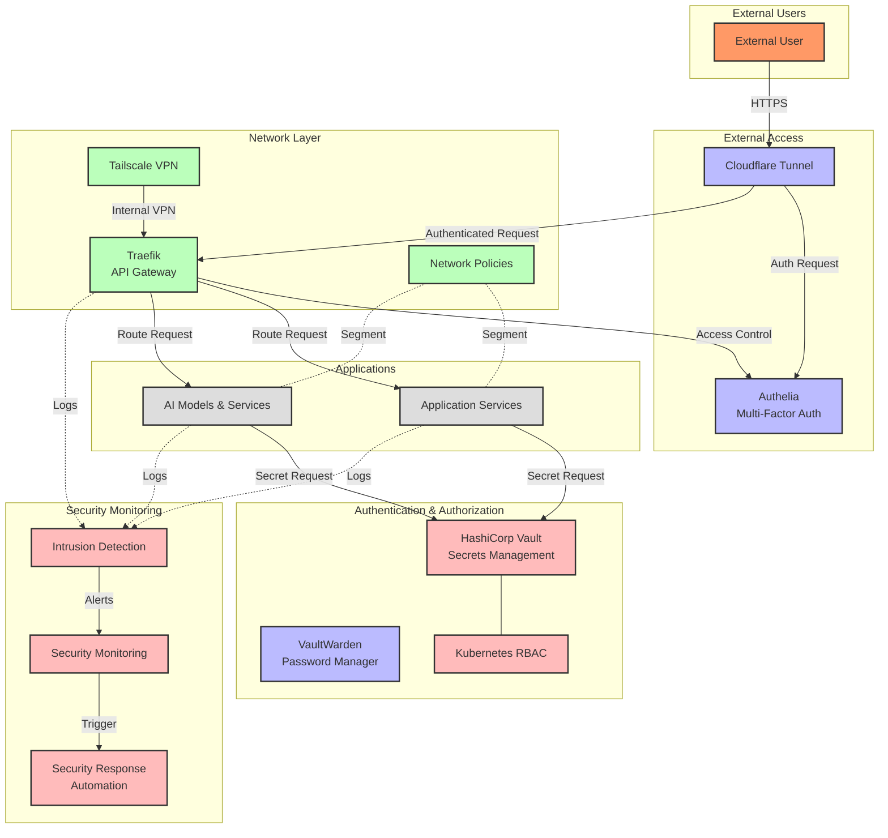
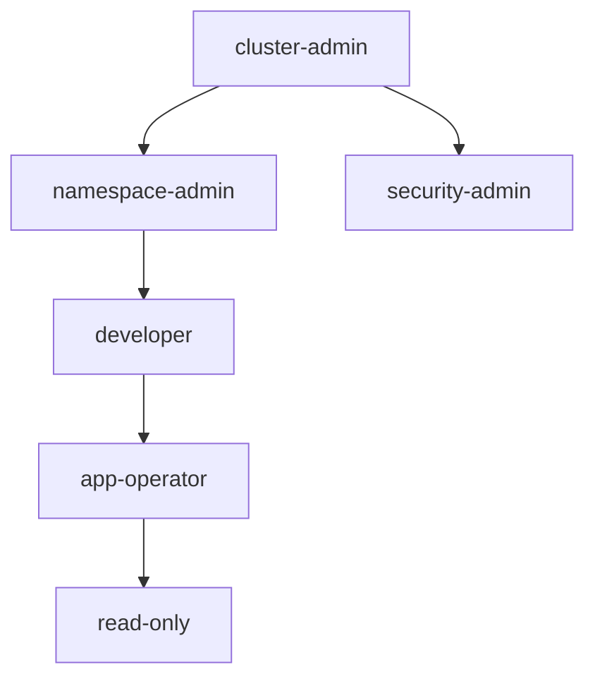
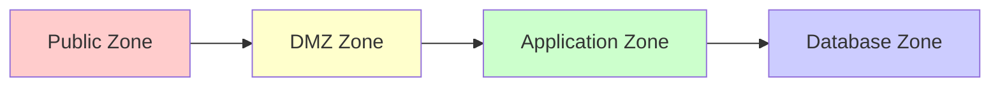
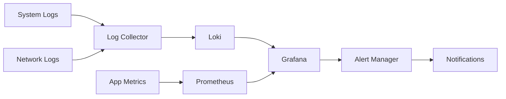
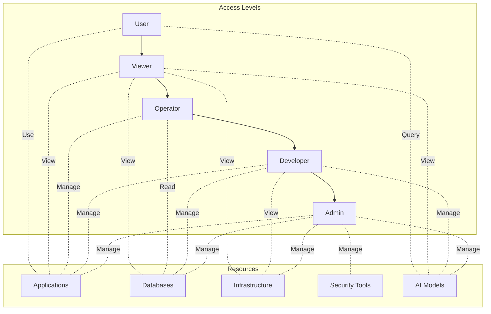
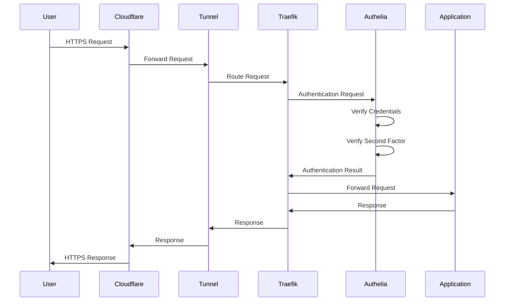
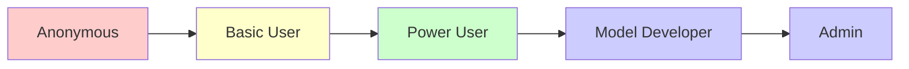
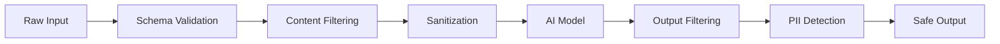

# Homelab Security Architecture Documentation

## Table of Contents
- [1. Overview](#1-overview)
  - [1.1 Security Components and Roles](#11-security-components-and-roles)
  - [1.2 Architecture Diagram](#12-architecture-diagram)
- [2. Component Configuration](#2-component-configuration)
  - [2.1 Authentication & Authorization](#21-authentication--authorization)
  - [2.2 Network Security](#22-network-security)
  - [2.3 Secret Management](#23-secret-management)
  - [2.4 Intrusion Detection](#24-intrusion-detection)
  - [2.5 Security Monitoring](#25-security-monitoring)
  - [2.6 AI Security](#26-ai-security)
- [3. Security Policies and Access Controls](#3-security-policies-and-access-controls)
  - [3.1 Authentication Policy](#31-authentication-policy)
  - [3.2 Authorization Matrix](#32-authorization-matrix)
  - [3.3 Secrets Management Policies](#33-secrets-management-policies)
  - [3.4 Audit Logging Policy](#34-audit-logging-policy)
- [4. Network Segmentation and Communication Security](#4-network-segmentation-and-communication-security)
  - [4.1 Network Zones](#41-network-zones)
  - [4.2 Traffic Flow Control](#42-traffic-flow-control)
  - [4.3 TLS Implementation](#43-tls-implementation)
  - [4.4 External Access Security](#44-external-access-security)
- [5. AI Model Security Practices](#5-ai-model-security-practices)
  - [5.1 Model Access Control](#51-model-access-control)
  - [5.2 Input and Output Validation](#52-input-and-output-validation)
  - [5.3 Rate Limiting and Resource Control](#53-rate-limiting-and-resource-control)
  - [5.4 Model Update Security](#54-model-update-security)
- [6. Incident Response Procedures](#6-incident-response-procedures)
  - [6.1 Incident Classification](#61-incident-classification)
  - [6.2 Response Workflow](#62-response-workflow)
  - [6.3 Automated Responses](#63-automated-responses)
  - [6.4 Post-Incident Analysis](#64-post-incident-analysis)
- [7. Security Posture Best Practices](#7-security-posture-best-practices)
  - [7.1 Regular Security Assessments](#71-regular-security-assessments)
  - [7.2 Updates and Patch Management](#72-updates-and-patch-management)
  - [7.3 Security Monitoring](#73-security-monitoring)
  - [7.4 Backup and Disaster Recovery](#74-backup-and-disaster-recovery)
- [8. Appendix](#8-appendix)
  - [8.1 Security Tool References](#81-security-tool-references)
  - [8.2 Configuration Examples](#82-configuration-examples)

---

## 1. Overview

The homelab security architecture implements a defense-in-depth approach, securing the infrastructure at multiple layers while maintaining usability for legitimate users. This document serves as a comprehensive guide to understanding and maintaining the security posture of the homelab environment.

### 1.1 Security Components and Roles

| Component | Role | Implementation |
|-----------|------|----------------|
| **Authentication** | Verifies user identity | Authelia, VaultWarden |
| **Authorization** | Controls access to resources | Kubernetes RBAC, Network Policies |
| **Network Security** | Secures network communication | Cloudflare Tunnels, Tailscale, TLS |
| **Secrets Management** | Secures sensitive information | HashiCorp Vault, Secret Rotation |
| **Intrusion Detection** | Identifies potential threats | Custom IDS Script, Security Monitoring |
| **Security Response** | Responds to security incidents | Security Response Automation |
| **AI Security** | Secures AI model operations | Model Access Control, Input/Output Validation |

### 1.2 Architecture Diagram



## 2. Component Configuration

### 2.1 Authentication & Authorization

#### Authelia

Authelia provides multi-factor authentication for all externally accessible services.

**Configuration Overview:**
- Deployment: Kubernetes StatefulSet with persistent storage
- Authentication Factors: Password + TOTP
- Integration: Traefik ForwardAuth middleware
- Identity Sources: Local file with hashed passwords

**Key Configuration Parameters:**
```yaml
jwt_secret: <secure_random_value>
authentication_backend:
  file:
    path: /config/users_database.yml
    password:
      algorithm: argon2id
      iterations: 3
      memory: 65536
      parallelism: 4
      salt_length: 16
      key_length: 32

access_control:
  default_policy: deny
  rules:
    - domain: "*.example.com"
      policy: two_factor
    - domain: "public.example.com"
      policy: bypass
```

#### HashiCorp Vault

HashiCorp Vault securely stores and manages secrets with strict access controls.

**Configuration Overview:**
- Deployment: Kubernetes StatefulSet with auto-unsealing
- Storage Backend: Integrated storage (Raft)
- Authentication Methods: Kubernetes, Token, AppRole
- Secret Engines: KV v2, PKI, Transit, Database

**Key Vault Policies:**
```hcl
# admin policy
path "secret/*" {
  capabilities = ["create", "read", "update", "delete", "list"]
}

# app-readonly policy
path "secret/data/{{identity.entity.aliases.auth_kubernetes_CLUSTER_ID.metadata.service_account_namespace}}/*" {
  capabilities = ["read", "list"]
}
```

#### Kubernetes RBAC

Role-Based Access Control for Kubernetes resources.

**Configuration Overview:**
- Default access: None (zero-trust)
- Service Account per application
- Custom roles for different access levels

**Role Structure:**


### 2.2 Network Security

#### Cloudflare Tunnels

Provides secure external access without opening inbound ports.

**Configuration Overview:**
- Deployment: cloudflared in Kubernetes
- Authentication: Mutual TLS with Cloudflare
- DNS Configuration: Automatic CNAME records
- Access Policies: Integrated with Authelia

#### Tailscale

Secure mesh VPN for internal access.

**Configuration Overview:**
- Deployment: Kubernetes DaemonSet as subnet router
- Authentication: Pre-authorized keys
- ACLs: Tailnet policy for device authorization
- DNS: Custom nameservers for internal resolution

#### Network Policies

Kubernetes network policies implementing microsegmentation.

**Default Policy:**
```yaml
kind: NetworkPolicy
apiVersion: networking.k8s.io/v1
metadata:
  name: default-deny-all
spec:
  podSelector: {}
  policyTypes:
  - Ingress
  - Egress
```

**Zone-based Policies:**


### 2.3 Secret Management

#### Secret Rotation

Automated rotation of secrets using a scheduled process.

**Configuration Overview:**
- Deployment: Kubernetes CronJob
- Integration: HashiCorp Vault
- Types: Database credentials, API keys, TLS certificates
- Validation: Pre-deployment testing
- Notifications: Alerts on rotation failures

#### Secure Configuration Management

Manages configuration securely with separation of sensitive data.

**Configuration Overview:**
- Deployment: Command-line tool + Kubernetes integration
- Encryption: AES-256 for sensitive values
- Schema Validation: JSON Schema for config validation
- Drift Detection: Identifies unplanned changes
- Distribution: Kubernetes ConfigMaps and Secrets

### 2.4 Intrusion Detection

Lightweight intrusion detection system monitoring for suspicious activities.

**Configuration Overview:**
- Deployment: Daemon on host or container
- Components:
  - Log Analyzer: Detects patterns in logs
  - Network Monitor: Identifies unusual traffic
  - Privilege Escalation Detector: Monitors for unauthorized elevation
  - Alert Manager: Sends notifications for events

**Detection Categories:**
```
- Failed Login Attempts
- SSH Brute Force
- Suspicious Commands
- Port Scanning
- Unusual Network Connections
- New SUID Binaries
- Sudo Configuration Changes
- Cron Job Modifications
```

### 2.5 Security Monitoring

Centralized security monitoring with alerting and visualization.

**Components:**
- Log Collection: Collects logs from all services
- Network Monitoring: Tracks traffic patterns
- Alerting: Notifies on suspicious activities
- Dashboards: Visualizes security posture

**Integration with Prometheus and Grafana:**


### 2.6 AI Security

Security controls specific to AI models and inference.

**Components:**
- Access Control: Limits who can use models
- Input Validation: Prevents harmful inputs
- Output Filtering: Screens generated content
- Rate Limiting: Prevents abuse
- Secure Model Updates: Protects the update process

## 3. Security Policies and Access Controls

### 3.1 Authentication Policy

| Access Type            | Authentication Requirements                                      |
|------------------------|------------------------------------------------------------------|
| External Web Access    | Authelia two-factor authentication (password + TOTP)             |
| VPN Access             | Tailscale authentication + device authorization                  |
| Admin Access           | Two-factor + IP restriction + audit logging                      |
| Service-to-Service     | mTLS certificates + service accounts                             |
| CI/CD Pipeline         | Limited-scope tokens + approval workflows                        |

**Session Management:**
- Maximum Session Duration: 12 hours
- Idle Timeout: 30 minutes
- Concurrent Session Limit: 3 per user
- Session Revocation: Available via admin interface

### 3.2 Authorization Matrix



### 3.3 Secrets Management Policies

**Secret Lifecycle Policy:**
- Creation: Secure generator with proper entropy
- Storage: Encrypted in Vault, access-controlled
- Usage: Least privilege, temporary access
- Rotation: Regular schedule based on sensitivity
- Revocation: Immediate when compromised
- Deletion: Secure with audit trail

**Rotation Schedule:**

| Secret Type            | Rotation Frequency | Auto-Rotation | Emergency Procedure                |
|------------------------|--------------------|---------------|------------------------------------|
| Database Credentials   | 30 days            | Yes           | Manual rotation + audit            |
| API Keys               | 90 days            | Yes           | Immediate revocation               |
| TLS Certificates       | 90 days            | Yes (cert-manager) | Revoke and reissue             |
| User Credentials       | 90 days            | No (user initiated) | Admin reset + notification    |
| Infrastructure Tokens  | 180 days           | Yes           | Revoke and reissue                 |

### 3.4 Audit Logging Policy

**Audit Events:**
- Authentication attempts (success/failure)
- Authorization checks (success/failure)
- Secret access (read/write)
- Administrative actions
- Configuration changes
- Network policy changes
- System component restarts
- Security service events

**Log Retention:**
- Security Events: 1 year
- System Logs: 90 days
- Network Logs: 30 days
- Application Logs: 14 days

## 4. Network Segmentation and Communication Security

### 4.1 Network Zones

The homelab uses a zone-based security model to separate components by sensitivity and function.

```mermaid
graph TB
    Internet((Internet))

    subgraph "Zone 0: DMZ"
        Ingress[Traefik Ingress]
        Auth[Authelia]
        CloudflareTunnel[Cloudflare Tunnel]
    end

    subgraph "Zone 1: Application Layer"
        Apps[Applications]
        APIServices[API Services]
    end

    subgraph "Zone 2: Service Layer"
        Services[Backend Services]
        AIModels[AI Models]
    end

    subgraph "Zone 3: Data Layer"
        Databases[(Databases)]
        Storage[(Storage)]
    end

    subgraph "Management Plane"
        Monitoring[Monitoring]
        Security[Security Services]
        Logging[Logging]
    end

    Internet <--> CloudflareTunnel
    CloudflareTunnel --> Ingress
    Ingress --> Auth
    Auth --> Apps
    Auth --> APIServices
    Apps --> Services
    APIServices --> Services
    Services --> AIModels
    Services --> Databases
    AIModels --> Storage

    Management Plane -.-> Zone 0: DMZ
    Management Plane -.-> Zone 1: Application Layer
    Management Plane -.-> Zone 2: Service Layer
    Management Plane -.-> Zone 3: Data Layer
```

**Zone Definitions:**
- Zone 0 (DMZ): Internet-facing services with strict access controls
- Zone 1 (Application): User-facing applications with controlled backend access
- Zone 2 (Service): Internal services not directly accessible from outside
- Zone 3 (Data): Data storage and processing with minimal external connections
- Management Plane: Administrative services with cross-cutting access

### 4.2 Traffic Flow Control

Traffic between zones is controlled using Kubernetes Network Policies.

**Default Policy: Deny All**
```yaml
apiVersion: networking.k8s.io/v1
kind: NetworkPolicy
metadata:
  name: default-deny-all
  namespace: default
spec:
  podSelector: {}
  policyTypes:
  - Ingress
  - Egress
```

**Example Zone Policy:**
```yaml
apiVersion: networking.k8s.io/v1
kind: NetworkPolicy
metadata:
  name: allow-zone1-to-zone2
  namespace: service-namespace
spec:
  podSelector:
    matchLabels:
      zone: zone2
  policyTypes:
  - Ingress
  ingress:
  - from:
    - namespaceSelector:
        matchLabels:
          zone: zone1
    ports:
    - port: 8080
      protocol: TCP
```

### 4.3 TLS Implementation

All service-to-service communication uses TLS, with configuration specific to sensitivity level.

**Internal TLS Configuration:**
- Certificate Authority: Self-hosted PKI with Vault
- Certificate Lifetimes: 90 days
- Cipher Suites: TLS 1.3 only with strong ciphers
- Certificate Deployment: cert-manager with automatic rotation
- Mutual TLS: Required for sensitive services

**TLS Minimum Standards:**
- Protocols: TLS 1.2+
- Key Exchange: ECDHE
- Ciphers: CHACHA20-POLY1305, AES-GCM
- Certificate Key Size: 2048+ (RSA), 256+ (EC)

### 4.4 External Access Security

External access to the homelab is secured through multiple layers of protection.

**Cloudflare Tunnels:**
- No inbound ports exposed to the internet
- End-to-end encryption
- DDoS protection
- WAF policies for common attacks

**Authentication Flow:**


## 5. AI Model Security Practices

### 5.1 Model Access Control

Access to AI models is controlled through a dedicated access control system.

**Controls Implemented:**
- Authentication and authorization for model endpoints
- Role-based access to different models
- Usage quotas and rate limiting
- Audit logging of model access
- Integration with system authentication

**Access Levels:**


### 5.2 Input and Output Validation

All AI model interactions are validated for security at both input and output.

**Input Validation:**
- Schema validation of input data
- Content filtering for harmful inputs
- Sanitization to prevent prompt injection
- Size and complexity limits
- Detection of adversarial examples

**Output Filtering:**
- Content safety checks
- Harmful output filtering
- PII detection and redaction
- Confidence thresholds
- Output logging for sensitive operations

**Validation Pipeline:**


### 5.3 Rate Limiting and Resource Control

Rate limiting prevents abuse and ensures fair resource allocation.

**Implementation:**
- Request limiting by user, IP, or application
- Token bucket algorithm
- Resource-based quotas for compute-intensive models
- Graduated response to limit exceedance
- Monitoring and alerting for abuse patterns

**Rate Limiting Configuration:**
```json
{
  "default_limits": {
    "requests_per_minute": 60,
    "tokens_per_request": 4000
  },
  "user_tiers": {
    "basic": {
      "requests_per_minute": 30,
      "max_parallel_requests": 2
    },
    "premium": {
      "requests_per_minute": 120,
      "max_parallel_requests": 5
    }
  }
}
```

### 5.4 Model Update Security

Secure model update practices to ensure integrity and authenticity.

**Update Process:**
- Signed model artifacts
- Version control with rollback capability
- Automated testing before deployment
- Access control for update operations
- Monitoring and alerting for update anomalies

## 6. Incident Response Procedures

### 6.1 Incident Classification

Incidents are classified based on severity and impact.

**Classification Levels:**
- Low: Minor issues with no immediate impact
- Medium: Issues with potential impact on services
- High: Significant issues affecting multiple services
- Critical: Major incidents with widespread impact

### 6.2 Response Workflow

Standardized workflow for incident response.

**Workflow Steps:**
1. Detection: Identify the incident
2. Classification: Determine severity
3. Containment: Limit the impact
4. Eradication: Remove the cause
5. Recovery: Restore services
6. Post-Incident Analysis: Review and improve

### 6.3 Automated Responses

Automated responses to common incidents.

**Examples:**
- Blocking IPs for repeated failed logins
- Restarting services on failure
- Scaling resources in response to load
- Isolating compromised components

### 6.4 Post-Incident Analysis

Review and analysis of incidents to improve future response.

**Analysis Components:**
- Incident timeline
- Root cause analysis
- Response effectiveness
- Lessons learned
- Action items for improvement

## 7. Security Posture Best Practices

### 7.1 Regular Security Assessments

Conduct regular security assessments to identify and mitigate risks.

**Assessment Types:**
- Vulnerability scanning
- Penetration testing
- Configuration reviews
- Compliance audits

### 7.2 Updates and Patch Management

Keep systems and applications up to date with the latest patches.

**Patch Management Process:**
- Regularly check for updates
- Test patches in a staging environment
- Apply patches in a controlled manner
- Monitor for issues post-deployment

### 7.3 Security Monitoring

Continuous monitoring of the security posture.

**Monitoring Components:**
- Log analysis
- Network traffic analysis
- Anomaly detection
- Alerting and notifications

### 7.4 Backup and Disaster Recovery

Ensure data integrity and availability through backups and disaster recovery planning.

**Backup Strategy:**
- Regular backups of critical data
- Offsite storage for redundancy
- Periodic testing of backup restoration
- Documented disaster recovery plan

## 8. Appendix

### 8.1 Security Tool References

List of tools used in the homelab security architecture.

**Tools:**
- Authelia: Multi-factor authentication
- HashiCorp Vault: Secrets management
- Traefik: API gateway
- Tailscale: Mesh VPN
- Prometheus: Monitoring
- Grafana: Visualization
- Loki: Log aggregation
- cert-manager: Certificate management

### 8.2 Configuration Examples

Examples of configuration files for various components.

**Authelia Configuration:**
```yaml
jwt_secret: <secure_random_value>
authentication_backend:
  file:
    path: /config/users_database.yml
    password:
      algorithm: argon2id
      iterations: 3
      memory: 65536
      parallelism: 4
      salt_length: 16
      key_length: 32

access_control:
  default_policy: deny
  rules:
    - domain: "*.example.com"
      policy: two_factor
    - domain: "public.example.com"
      policy: bypass
```

**Vault Policy:**
```hcl
# admin policy
path "secret/*" {
  capabilities = ["create", "read", "update", "delete", "list"]
}

# app-readonly policy
path "secret/data/{{identity.entity.aliases.auth_kubernetes_CLUSTER_ID.metadata.service_account_namespace}}/*" {
  capabilities = ["read", "list"]
}
```

**Network Policy:**
```yaml
apiVersion: networking.k8s.io/v1
kind: NetworkPolicy
metadata:
  name: allow-zone1-to-zone2
  namespace: service-namespace
spec:
  podSelector:
    matchLabels:
      zone: zone2
  policyTypes:
  - Ingress
  ingress:
  - from:
    - namespaceSelector:
        matchLabels:
          zone: zone1
    ports:
    - port: 8080
      protocol: TCP
```

