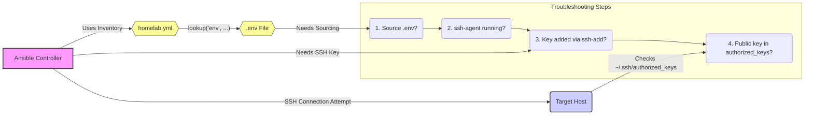

# 🔑 Troubleshooting Ansible SSH Connection Issues

This guide helps diagnose and fix common SSH connection problems when using Ansible, particularly focusing on errors like `Permission denied` and `hostname contains invalid characters`. We'll follow the Pareto Principle (80/20 rule) - focusing on the 20% of causes that lead to 80% of the problems.

## 🎯 The Goal: Successful Ansible Ping

The primary test for basic connectivity is the Ansible `ping` module:

```bash
# 1. Navigate to your project directory (e.g., homelab-infra)
cd /path/to/your/homelab-infra

# 2. Load environment variables (CRUCIAL!)
# Option A: Standard source
source .env
# Option B: Source with automatic export (sometimes needed)
# set -a; source .env; set +a

# 3. Run the ping test
ansible <hostname_or_group> -i ansible/inventory/homelab.yml -m ping
```

A `SUCCESS` message (usually green) means everything is working! If you get `UNREACHABLE` or `FAILED` (usually red), let's troubleshoot.

## 🚨 Common Errors & The 80/20 Rule

Most Ansible SSH connection issues boil down to these core problems:

1.  **Environment Variables Not Loaded (➡️ `hostname contains invalid characters`)**: Ansible can't find the target IP/hostname because the `lookup('env', ...)` in your inventory failed.
2.  **SSH Agent Issues (➡️ `Permission denied`)**: The SSH agent isn't running, or your private key isn't loaded into it.
3.  **Incorrect Remote Keys (➡️ `Permission denied`)**: The corresponding *public* key is missing or incorrect on the target machine.

Let's tackle these!



### 1. Environment Variables (`.env` File) 🌍

**Problem:** You see `Failed to connect to the host via ssh: hostname contains invalid characters`.

**Why:** Your inventory ([`ansible/inventory/homelab.yml`](../ansible/inventory/homelab.yml)) uses `lookup('env', 'VAR_NAME')` to find host IPs and usernames defined in your [`.env`](../.env) file. If these variables aren't loaded into your *current terminal session*, the lookup fails.

**Solution:**

**Always `source .env` first!** Before running *any* `ansible` or `ansible-playbook` command in a new terminal:

```bash
# Navigate to the directory containing .env (e.g., homelab-infra)
cd /path/to/your/homelab-infra

# Source the file
source .env
```
*   **Verify:** Check if a variable loaded correctly:
    ```bash
    echo $BEELINK_HOST
    # Should print the IP address, e.g., 192.168.0.50
    ```
*   **Alternative (if `source` isn't exporting):**
    ```bash
    set -a; source .env; set +a
    ```

### 2. SSH Agent & `ssh-add` (Your Machine) 🕵️‍♂️

**Problem:** You see `Permission denied (publickey,password,keyboard-interactive)`. The hostname resolves, but authentication fails.

**Why:** Ansible uses SSH keys for authentication by default. The `ssh-agent` is a background program that securely holds your private keys in memory, so you don't have to type passphrases constantly. Ansible relies on the agent to provide the correct key.

**Solution:**

*   **Check if the agent is running:**
    ```bash
    ssh-add -l
    ```
*   **If you get `Could not open a connection to your authentication agent.`:** Start the agent:
    ```bash
    eval "$(ssh-agent -s)"
    # Expected output: Agent pid XXXXX
    ```
*   **Add your private key to the agent:** (Replace with your actual key file, e.g., `id_rsa`)
    ```bash
    ssh-add ~/.ssh/id_ed25519
    # Enter passphrase if prompted
    ```
*   **Verify again:** `ssh-add -l` should now list your key's fingerprint.

### 3. Authorized Keys (Remote Host) 🔑➡️🚪

**Problem:** Still getting `Permission denied` even after checking the SSH agent.

**Why:** For key authentication to work, the *public key* corresponding to the private key loaded in your `ssh-agent` must exist in the `~/.ssh/authorized_keys` file on the *target machine* for the user Ansible is trying to connect as (e.g., `sprime01` on `beelink`).

**Solution:**

*   **Identify the public key:** Find the public key file matching your private key (e.g., `~/.ssh/id_ed25519.pub`). Copy its contents.
*   **SSH into the target machine manually:**
    ```bash
    ssh <user>@<target_host_ip>
    # e.g., ssh sprime01@192.168.0.50
    ```
    *If this *also* fails, the core SSH setup is the issue.*
*   **Check/Add the key on the target machine:**
    ```bash
    # On the target machine (e.g., beelink)
    mkdir -p ~/.ssh       # Create .ssh directory if it doesn't exist
    chmod 700 ~/.ssh      # Set correct permissions
    touch ~/.ssh/authorized_keys # Create the file if it doesn't exist
    chmod 600 ~/.ssh/authorized_keys # Set correct permissions

    # Check if your public key is already there
    cat ~/.ssh/authorized_keys

    # If missing, paste your public key onto a new line in the file
    # (You can use 'nano ~/.ssh/authorized_keys' or echo/append)
    # echo "ssh-ed25519 AAAAC3NzaC1lZDI1NTE5.... your_email@example.com" >> ~/.ssh/authorized_keys
    ```
*   **Test manual SSH again:** Ensure you can log in without a password.
*   **Retry Ansible ping.**

## ✅ Quick Checklist

- [ ] Are you in the correct project directory (`homelab-infra`)?
- [ ] Did you run `source .env` in your *current* terminal?
- [ ] Is `ssh-agent` running? (`eval "$(ssh-agent -s)"` if needed)
- [ ] Is your private key added? (`ssh-add ~/.ssh/your_key`; check with `ssh-add -l`)
- [ ] Is the corresponding *public* key in `~/.ssh/authorized_keys` on the target host for the correct user?
- [ ] Can you SSH manually (`ssh user@host`) without a password?

By focusing on these common areas, you can efficiently resolve most Ansible SSH connection problems. Happy automating! 🚀
